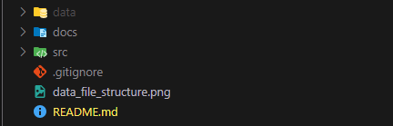
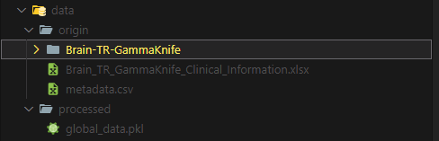

## Project structure

### data/

contains the raw and processed data

### docs/

contains useful documents

### src/

contains the code

## data

data/origin should contain:

 - *Brain-TR-GammaKnife* folder that contains the raw medical imaging files
 - *metadata.csv* that contains metadata relative to the raw medical imaging files
 - *Brain_TR_GammaKnife_Clinical_Information.xlsx* that contains the clinical records

Link to the brain mri dataset:\
https://www.cancerimagingarchive.net/collection/brain-tr-gammaknife/

## Folders (inside src)

### models/
Deep learning models

### configs/
Models base configurations

### datasets/
Dataloaders

### log/
Models checkpoints

## Most ipmortant files (inside src)

### python3 data_reader.py --debug

It reads the raw medical data present inside data/origin/

The final result is saved in the data/processed/global_data.pkl which consists of a dictionary containing clinical records, cropped MRI, cropped radiation dose maps, subject ids and labels. The debug flag, if set, selects only one subject (used for debugging).

### python3 grid_search_keep_test.py --config configs/base_model.yaml --experiment_name basemodelexp1 --k 5

Different parameters are tested by using the same test set proposed by the dataset's article. Parameters are chosen from the params_grid.py file that overwrites the base configuration passed as an argument. By setting k to 5 a stratified 5 fold cross validation is used to produce 5 different train/validation splits

### python3 grid_search_whole_dataset.py --k 10 --config configs/base_model.yaml --experiment_name basemodelexp1

Different parameters are tested by cross validating the whole dataset. Parameters are chosen from the params_grid.py file that overwrites the base configuration passed as an argument. By setting k to 10 a stratified 10 fold cross validation is used to produce 10 different train/test splits. From each train set an enough number of samples is held out to constitute a validation set.

### python3 train_classifier.py --config configs/base_model.yaml --experiment_name basemodelexp1 --version 0

Used mainly for debugging, adopts a static split during training. The chosen base configuration path is passed as argument

### python3 display_lesions.py

Save inside display/lesions/ the processed lesions (pictures), which are stored in the dictionary saved in data/ptocessed/global_data.pkl produces by the data_reader.py script.

### modules/classification_module.py
Handles the classification process. Specifically, set the chosen model, handles the training, validation and test steps and epochs, set the optimizer...

### datasets/classification.py
Is the dataloader. Main preprocessing is done here and the splits are generated here as well.
